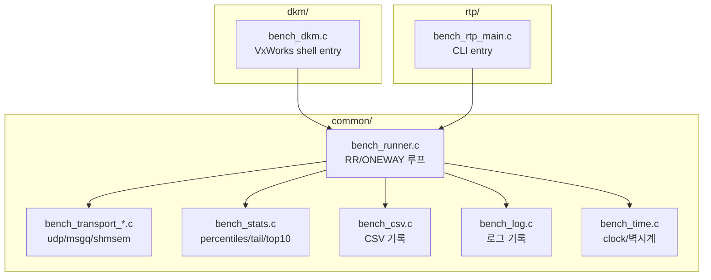
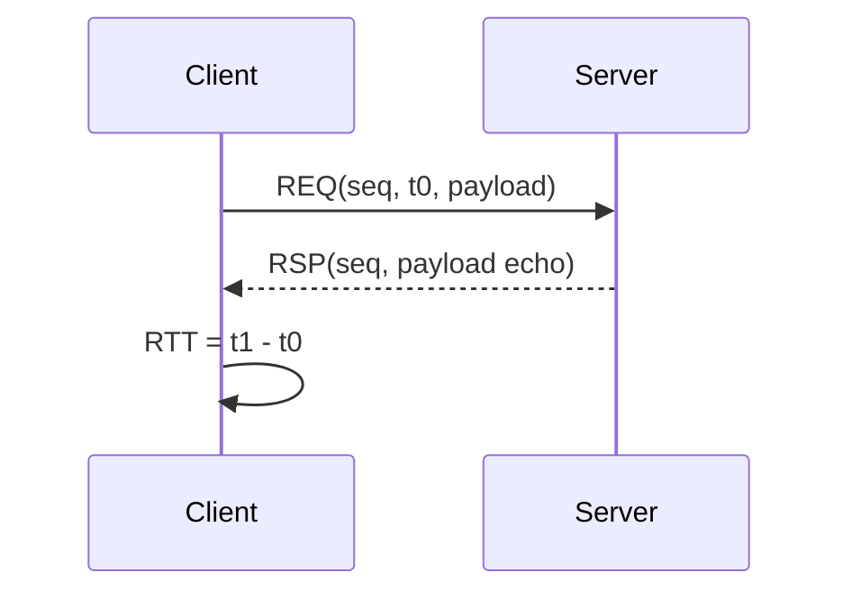
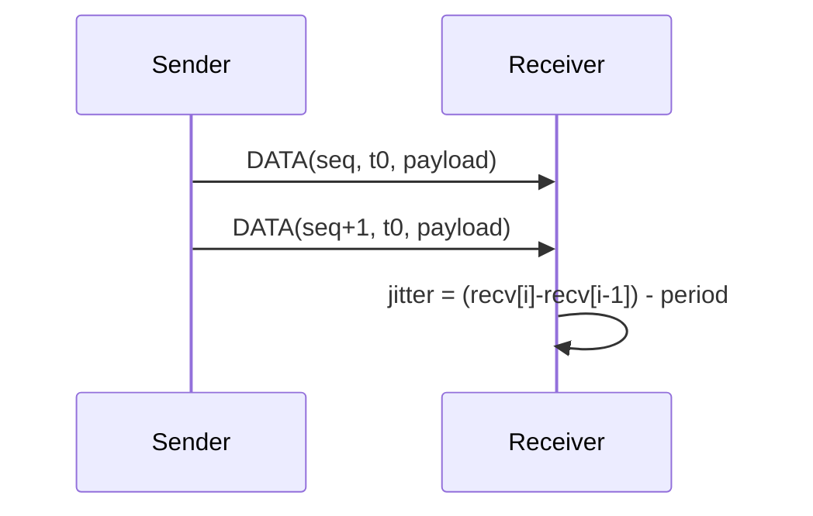
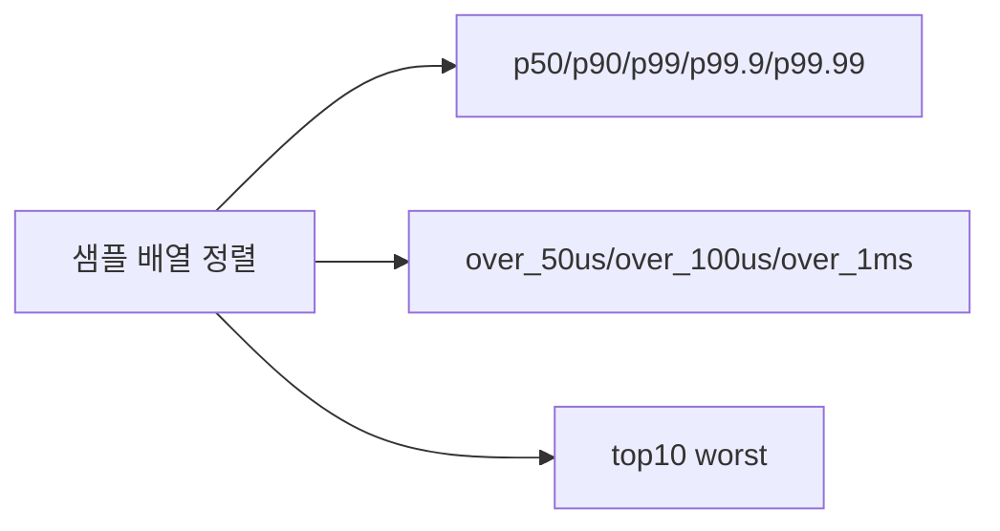
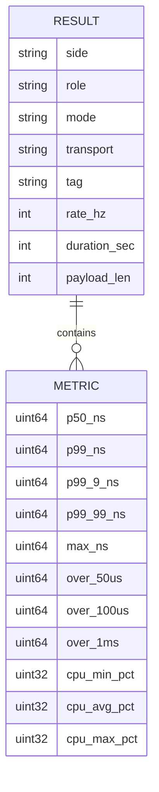

# IPC Benchmark 설계 (VxWorks 23.03, DKM/RTP)

## 목적
- 동일 타겟에서 DKM(.out)과 RTP(.vxe)의 IPC 지연/지터를 동일 조건으로 비교
- RR(왕복 RTT)과 ONEWAY(수신 간격 지터) 방식으로 품질 측정

## 프로젝트 구조


## 실행 모델
```mermaid
flowchart LR
    DKM[DKM (.out)] -- rtpSpawn --> RTP[RTP (.vxe)]
    DKM -- client/server --> BR1[bench_runner]
    RTP -- client/server --> BR2[bench_runner]
```
- 기본 흐름: DKM이 RTP를 실행하고, 클라이언트/서버 역할을 분담해 수행
- RR/ONEWAY 모두 동일한 공용 러너(bench_runner)를 사용

## RR(REQ/RSP) 측정 방식

- 클라이언트가 t0를 찍고 요청 전송, 응답 수신 후 t1로 RTT 계산
- 서버는 즉시 echo 응답(요청 payload 그대로)

## ONEWAY(DATA) 측정 방식

- 단방향 스트림, 수신 측에서 inter-arrival 지터를 계산

## IPC 전송 방식
```mermaid
flowchart TB
    UDP[udp] --> U1[socket/AF_INET]
    UDP --> U2[bind/dst, port]
    SHM[shmsem] --> S1[shm_open + mmap]
    SHM --> S2[ring buffer x2 (c2s/s2c)]
    SHM --> S3[sem_open notify]
    MSG[msgq] --> M1[msgQOpen]
    MSG --> M2[req/rsp queue 2개]
```
- UDP: loopback(127.0.0.1) 기본, port 41000
- SHM+SEM: shm ring 2개(c2s/s2c) + 세마포어 알림
- MSGQ: 요청/응답 큐를 분리하여 왕복 흐름 구성

## 품질 지표 계산

- percentile: nearest-rank(반올림 인덱스) 방식
- tail: 임계치 초과 카운트(빈도 기반)
- top10: 최악 지연 10개를 내림차순 출력

## 결과 출력(로그/CSV)

- RR: RTT 기반 지연 품질(p50/p99/p99.9/p99.99/max, tail, top10)
- ONEWAY: 수신 간격 지터 품질(p50/p99/p99.9/p99.99/max, tail, top10)
- CPU: DKM은 spy 기반 시스템 CPU, RTP는 자체 CPU time 기반

## 결과값 간단 설명
- p50/p99/p99_9/p99_99: 중앙/테일 지연 수준
- over_*: 지연 임계치 초과 빈도
- top10: 최악 지연 샘플(스파이크 분석용)
- sent/received/loss/ooo/tx_fail: 송수신 신뢰성 지표
